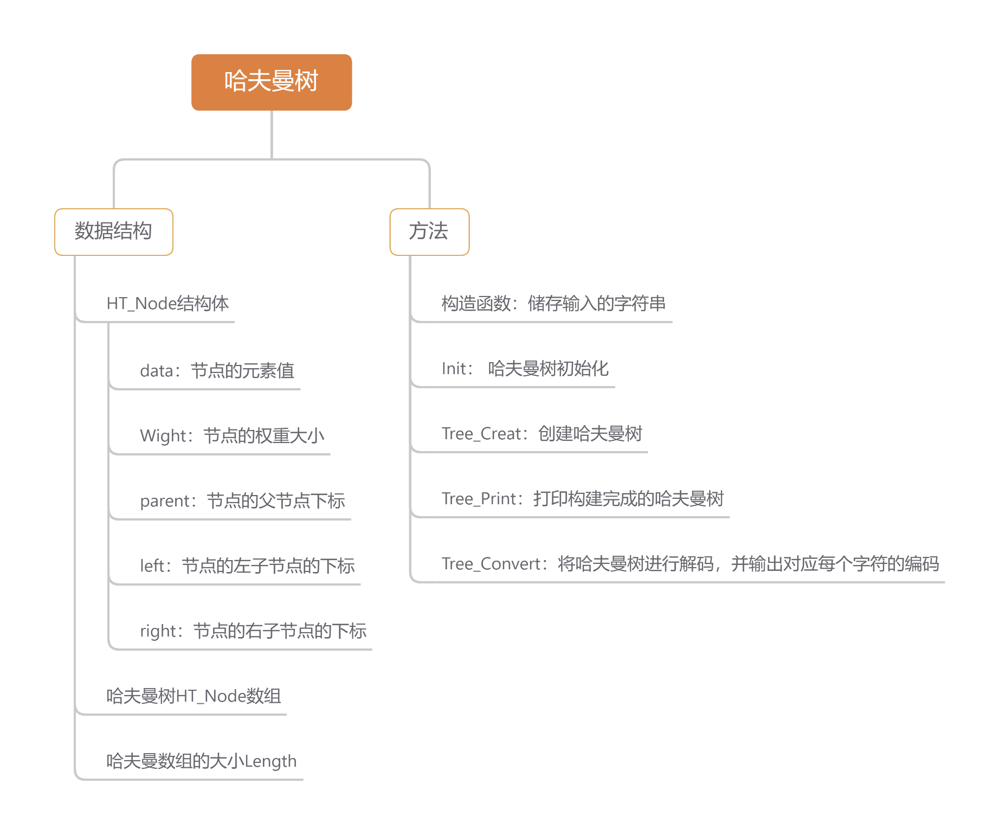
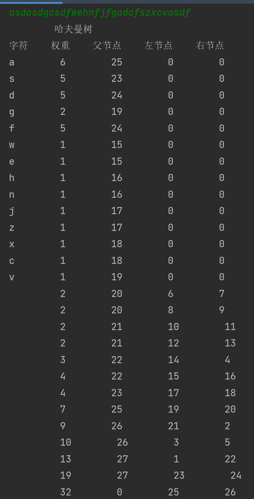
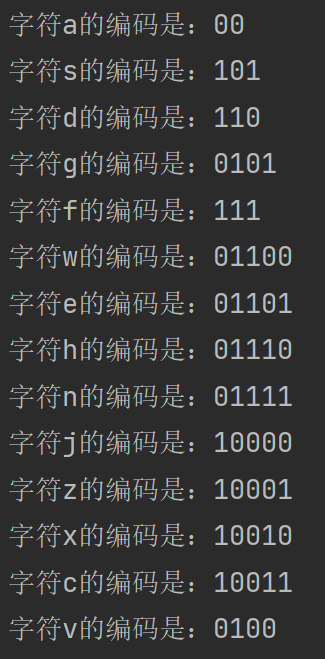

实验2-2 哈夫曼树

# 实验目的

1. **构造哈夫曼树**

2. **求解哈夫曼编码**

# 实验内容

根据哈夫曼树的原理设计一个程序使其能够根据一串字符串构造哈夫曼树，并且能够根据构造的哈夫曼树生成哈夫曼编码

## 实验环境

此次实验环境为CLion，语言为C++，采用C17标准

## 内容结构

实验内容包括两个文件：Huffman_Tree.h和Huffman_Tree.cpp.

Huffman_Tree.h中的包括一个类名HuffTree，其中包含了哈夫曼树的数据结构与各种方法，具体见文件内容；

# 主要算法流程图

# 实验测试

该程序可以将输入的字符串转化为哈夫曼树并进行编码

1. 第一步输入字符串，程序会生成对应的哈夫曼树并打印出来

    

2. 输出所有字符的编码

