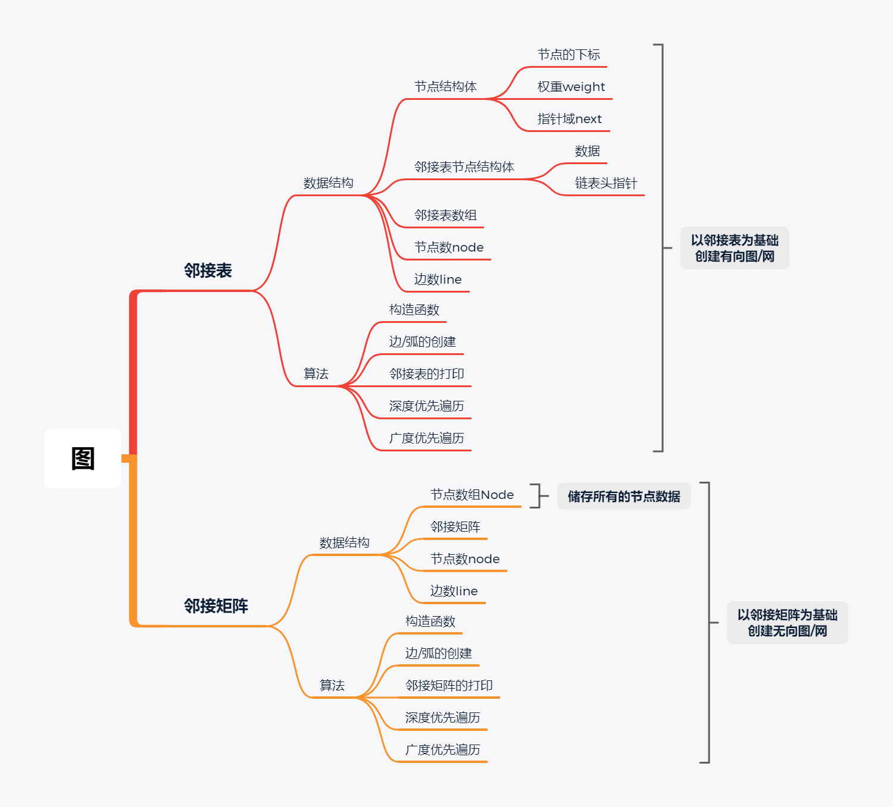

实验三

# 实验目的

1. 根据**邻接矩阵**实现图的基本操作，并设计图的**深度优先搜索遍历**算法和**广度优先搜索遍历**算法。
2. 根据**邻接表**实现图的基本操作，并设计图的**深度优先搜索遍历**算法和**广度优先搜索遍历**算法。

# 实验内容

通过邻接矩阵和邻接图两种数据结构构造图，并实现图的基本操作，包括节点的创建、弧/边的建立、图的遍历等

## 实验环境

此次实验环境为CLion，语言为C++，采用C17标准

## 内容结构

项目文件中包含两个目录Header、User。Header中存放头文件“AdjacencyList.h”，“AdjacencyMat.h”，User中存放着“AdjacencyList.cpp”、"AdjacencyMat.cpp"、"main.cpp"。

“AdjacencyList.h”中声明了以邻接表为基础的图的实现，包括一些图的基本操作和遍历
		“AdjacencyMat.h”中声明了以邻接矩阵为基础的图的实现，包括一些图的基本操作和遍历

# 算法流程图

# 实验操作

在主程序中已给例程序，运行主程序按照提示进行操作即可。

