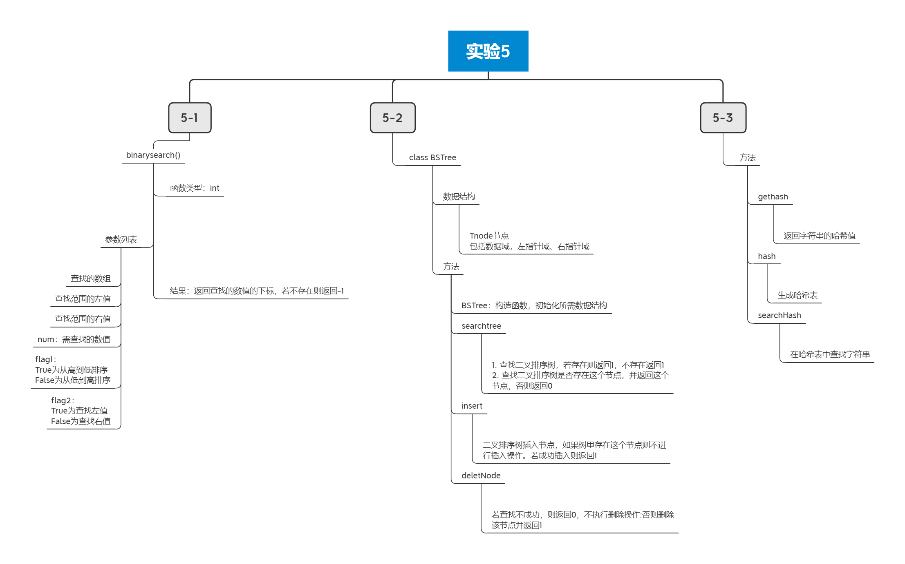

<center><font size=6>实验五</font></center>

# 实验目的

1. 给定有序整型数组A[n]和整数x，试设计一个在A中查找x的折半查找算法。 

2. 设二叉排序树采用二叉链表存储结构：
    试设计二叉排序树的查找算法、插入算法和删除算法。

3. 哈希表设计。为班级30个人的姓氏(单字姓)设计一个哈希表，假设姓氏用汉语拼音表示。要求用除留取余法构造哈希函数，用线性探测再散列法处理冲突，平均查找长度的上限为2。

# 实验内容

项目文件目录如下：


1. Binary_search.h中为实验5-1的代码片段，包括一个排序算法、一个二分查找的算法
2. BinarySortTree.h和BinarySortTree.cpp为实验5-2的代码，包括二叉排序树的数据结构以及插入、查找、删除算法。
3. Hash.h为实验5-3的代码，包括求字符串的哈希值函数、hash表建立函数、以及hash表的查找算法。



# 实验原理

## 实验5-1

```C++
int binarysearch(int q[], int l, int r, int num, bool flag1=false, bool flag2=false)
{
    /*
    	左值和右值代表若有一组连续相同的数字，是返回第一个坐标还是最后一个坐标
    	例如： 1 3 4 4 4 5 6的一个序列
    	若查找4，左值即为下标为2的4，右值即为下标为4的4；
    */
    if(flag1)//flag1代表是降序还是升序，True为降序
    {
        if(flag2)//查找左值
        {
            while(l < r)
            {
                int mid = l + r >> 1;
                if(q[mid] < num) r = mid - 1;
                else l = mid;
            }
        }
        else//查找右值
        {
            while(l < r)
            {
                int mid = l + r >> 1;
                if(q[mid] <= num) r = mid;
                else l = mid + 1;
            }
        }
    }
    else//升序
    {
        if(flag2)
        {
            while(l < r)
            {
                int mid = l + r >> 1;
                if(q[mid] > num) r = mid - 1;
                else l = mid;
            }
        }
        else
        {
            while(l < r)
            {
                int mid = l + r >> 1;
                if(q[mid] >= num) r = mid;
                else l = mid + 1;
            }
        }
        if(q[l] != num) return -1;
        else return l;
    }
}
```

## 实验5-2

```C++
class BSTree
{
private:
    typedef struct TNode
    {
        int data;
        TNode *lc;  //左孩子
        TNode *rc;  //右孩子
    }TNode, *Tree;

public:
    Tree root; //根节点

    BSTree(); //构造函数

    //查找二叉排序树，若存在则返回1，不存在返回1
    int searchtree(Tree T, int key);

    //查找二叉排序树是否存在这个节点，并返回这个节点，否则返回0
    Tree searchtree(Tree T, int key, Tree &p);

    //二叉排序树插入节点，如果树里存在这个节点则不进行插入操作。若成功插入则返回1
    int insert(Tree &T, int key);

    //若查找不成功，则返回0，不执行删除操作;否则删除该节点并返回1
    int deleteNode(Tree &T, int key);
};
```

具体实现

```c++
BSTree::BSTree()
{
    this->root = (Tree) malloc(sizeof(TNode));
    this->root->data = -1;
    this->root->lc = this->root->rc = NULL;
}

int BSTree::searchtree(Tree T, int key)
{
    if(!T) return 0;
    if(T->data == key) return 1;
    if(key < T->data) return searchtree(T->lc, key);
    else return searchtree(T->rc, key);
}

BSTree::Tree BSTree::searchtree(Tree T, int key, Tree &p)
{
    if(!T) return 0;
    if(key == T->data) return T;
    p = T;
    if(key < T->data) return searchtree(T->lc, key, p);
    return searchtree(T->rc, key, p);
}

int BSTree::insert(Tree &T, int key)
{
    Tree p = T;
    if(searchtree(T, key, p)) return 0;
    Tree s = (Tree)malloc(sizeof(BSTree::TNode));
    s->data = key;
    s->lc = s->rc = NULL;
    if(!p) T = s;
    else
    {
        if (key < p->data) p->lc = s;
        else p->rc = s;
    }
    return 1;
}

int BSTree::deleteNode(Tree &T, int key)
{
    Tree p = T;
    if(!searchtree(T, key, p)) return 0;
    //删除操作
    if(p->lc == NULL && p->rc != NULL)
    {
        Tree q = p->rc;
        p->data = q->data;
        p->lc = q->lc, p->rc = q->rc;
        free(q);
    }
    else if(p->lc != NULL && p->rc == NULL)
    {
        Tree q = p->lc;
        p->data = q->data;
        p->lc = q->lc, p->rc = q->rc;
        free(q);
    }
    else if(p->lc != NULL && p->rc != NULL)
    {
        Tree q = p, s = p->lc;
        while(s->rc) {p = s; s = s->rc;}
        q->data = s->data;
        if(p == q) q->lc = s->lc;
        else p->rc = s->lc;
    }
}
```

## 实验5-3

```c++
int gethash(std::string str)//计算字符串的哈希值，哈希函数为字符串的最后一个字母的ASCII码减去第一个字母再乘以字符串长度
{
    int len = str.length();
    return (abs(str[len - 1] - str[0]) * len) % HASHCODE;
}

void hash(std::string strs[], std::string str)//构造一个哈希表，若不存在str字符串，则将其加入哈希表中
{
    int index = gethash(str);
    if(strs[index] == "") strs[index] = str;
    else
    {
        while(strs[index] != "" && index < HASHLENGTH) index += di;
        strs[index] = str;
    }
}

int searchHash(std::string name, std::string names[], int &count)//在哈希表中搜索字符串并返回下标
{
    int index = gethash(name), n = 1;
    while(index < HASHLENGTH)
    {
        if(names[index] == name)
        {
            count = n;
            return index;
        }
        index += di;
        n += 1;
    }
    return -1;
}
```


